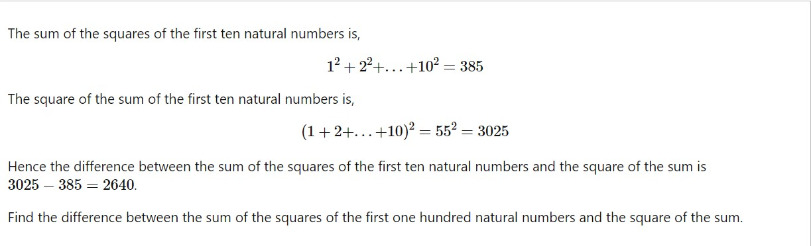

# Question

# Answer
- The for loop runs from i=1 to i=100, and for each i, it calculates the square of i and adds it to the variable sumOfsq. Additionally, it adds the value of i to the variable sum.
- After the for loop, the square of the sum (sqOfSum) is calculated by squaring the value of the variable sum.
- The difference between the sum of the squares of the first 100 natural numbers and the square of the sum is calculated by subtracting the value of sumOfsq from sqOfSum, and the result is stored in the variable "total".